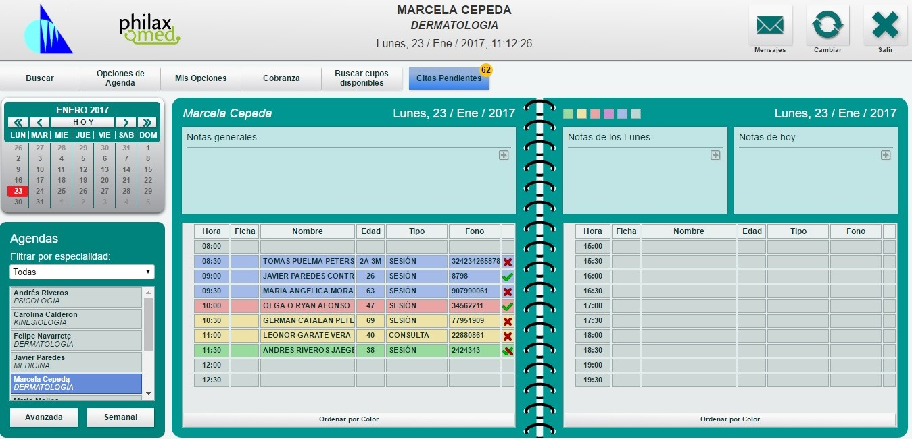

Vista inicial
*************

Al ingresar al módulo, se accede directamente a la vista inicial de la Agenda. Desde aquí se pueden acceder a todas las operaciones necesarias para manejar sus citas y pacientes. Aquí se visualiza el menú principal con todas las opciones pacientes, usuarios y agendas, un calendario para recorrer las agendas y el listado de todas agendas del centro. A partir de esta vista se puede acceder tanto al módulo de cobranza como a las fichas clínicas, si es que el usuario cuenta con los permisos correspondientes.

* **Datos del usuario:** En la parte superior de la página, se identifica al usuario que ingresó a la aplicación con su nombre y especialidad.
* **Logos:** La vista por defecto trae el logo institucional del centro y el de Philaxmed®, este último puede ser quitado si el usuario lo desea contactando al equipo de soporte.
* **Calendario:** A la izquierda se encuentra el calendario, el cual permite al usuario seleccionar el día en que desea agendar o revisar agendamientos anteriores o posteriores.
* **Agendas:** Los usuarios administrativos o clínicos pueden ver el listado de agendas con su especialidad respectiva, por defecto están visibles todas las agendas, sin embargo, se puede filtrar por especialidad. En el caso de que un centro desida ocultar la visibilidad de ciertas agendas para algunos usuarios se pueden contactar con el equipo de Soporte para realizar los filtros necesarios.
* **Agenda profesional:** El usuario clínico tiene su agenda dividida en periodos de tarde y mañana, ésta permite agendar, cambiar el estado de de la cita, escribir notas generales, notas para un día de la semana y notas para un día especifico del calendario.
* **Estado del paciente:** El proceso de la atención de cada paciente se reconoce mediante los colores de la cita; el color verde significa paciente agendado, color amarillo paciente confirmado, color rojo llegada del paciente, color morado paciente en atención, color azul paciente atendido y color gris paciente no se presentó. Cada una de éstos estados son activados y desactivados por los usuarios administrativos y clínicos.
* **Ordenar citas:** En la parte inferior de la pantalla el sistema permite ordenar las citas reservadas por color, y al presionar los botones hora, nombre, edad, tipo y cita estos se ordenan por abecedario, menor a mayo o viceversa. 
* **Botón mensajes:** El equipo de Philaxmed®  alertará al usuario a través del botón de mensajes cuando desee informar respecto a modificaciones y/o actualizaciones en el sistema.
* **Botón cambiar:** Cuando un centro tiene más de una sucursal éste botón permite navegar entre las sucursales del centro.
* **Botón salir:** Permite cerrar sesión y salir de la agenda.
