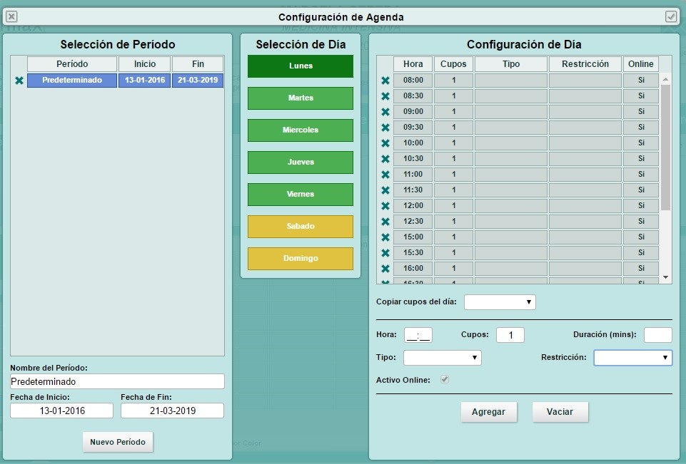
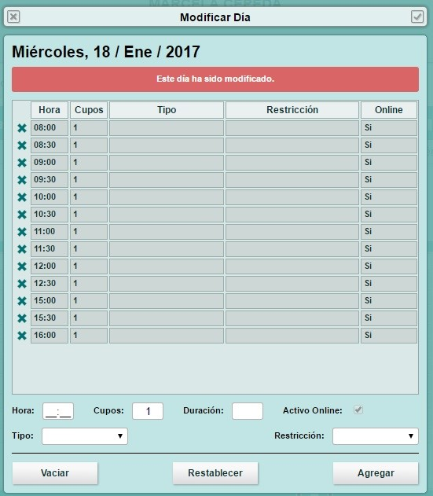

Configurar horarios de mi Agenda
********************************

Desde el modulo de atenda los usuarios 

Congifuraciíon de Agenda
------------------------
Desde “Opciones de agenda” se despliega un listado de alternativas, entre ellas están “Configurar agenda” y “Modificar día”.
“Configurar agenda” es una herramienta con la cual se puede asignar el periodo de trabajo durante cada día de la semana. Cuando una agenda es creada, ésta por defecto viene con un periodo ya asignado de un año.

* **Selección de periodo:** permite editar o crear un nuevo periodo, modificando nombre, fecha de inicio y fecha de término.
* **Selección de día:** permite seleccionar el día deseado para configurar.
* **Configuración de día:** al tener un día ya seleccionado podemos configurar los cupos de la agenda, ingresando la hora, cantidad de cupos por hora, duración del cupo en minutos, tipo de atención, restricción y activar todos o ciertos cupos para agendamiento online. Si todos los días tienen el mismo horario es recomendable utilizar la funcionalidad “Copiar cupos del día”.

Una vez terminada la configuración, es muy importante cerrar la ventana con el “Check”, para que la información ingresada quede guardada. 

Modificar día
-------------

Desde “Opciones de agenda” el sistema permite modificar la agenda de un día en específico, dicha modificación no altera la configuración de agenda para los demás días.
Para realizar éste procedimiento es importante seleccionar la agenda y la fecha que se desea modificar, luego de eliminar o agregar los cupos correspondientes. En ésta vista una vez guardadas las modificaciones se visualizará una de las siguientes leyendas “Este día ha sido modificado” y “Este es un día normal”.

