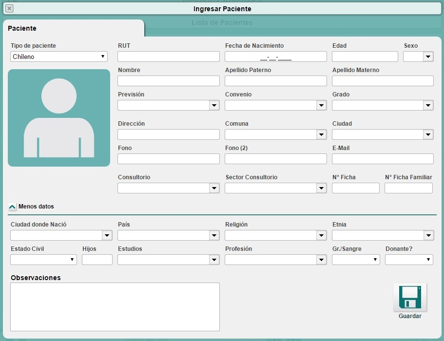
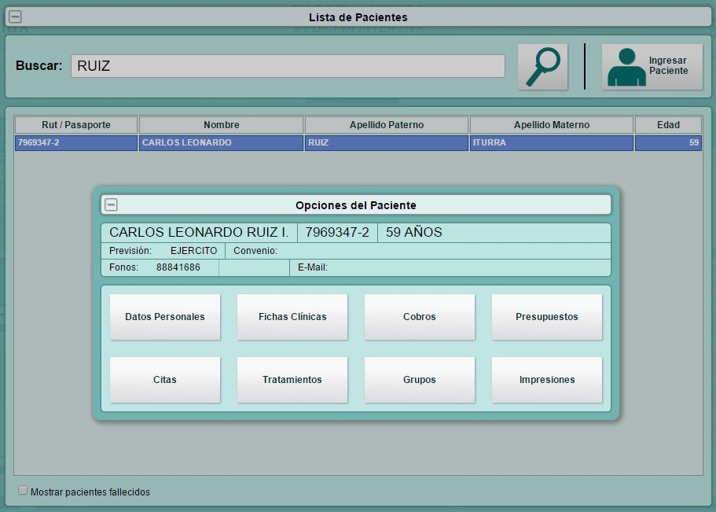

Creación y edición Pacientes
****************************

Desde la vista inicial de la agenda, existe el botón de buscar pacientes, el cual permite registrar un paciente o editar uno ya existente. 

Crear un paciente
-----------------

Para crear un nuevo paciente se debe ingresar desde el botón “Ingresar paciente”.

* **Datos del paciente:** existe una variedad de datos personales del paciente para completar, sin embargo, solo algunos de éstos son obligatorios; RUT, Sexo, Nombre y Apellido. 
* **Tipo de paciente:** el sistema también permite ingresar pacientes que sean extranjeros mediante el número de pasaporte y/o pacientes sin identificación.
* **Defunción del paciente:** mediante un permiso asignado por el equipo de soporte Philaxmed, se pude registrar la defunción de un paciente.
* **Observaciones:** Permite registrar cualquier información relevante del paciente.

Una vez terminado el registro de pacientes, clickear el botón “Guardar”

Edición de pacientes
--------------------

La búsqueda de un paciente ya registrado puede ser mediante RUT, pasaporte, nombre y apellidos. Una vez identificado el paciente se debe clickear en datos personales e ingresar o modificar lo deseado.
Philaxmed® permite conocer que usuario fue quien registró o modificó por última vez los datos personales de un paciente.

